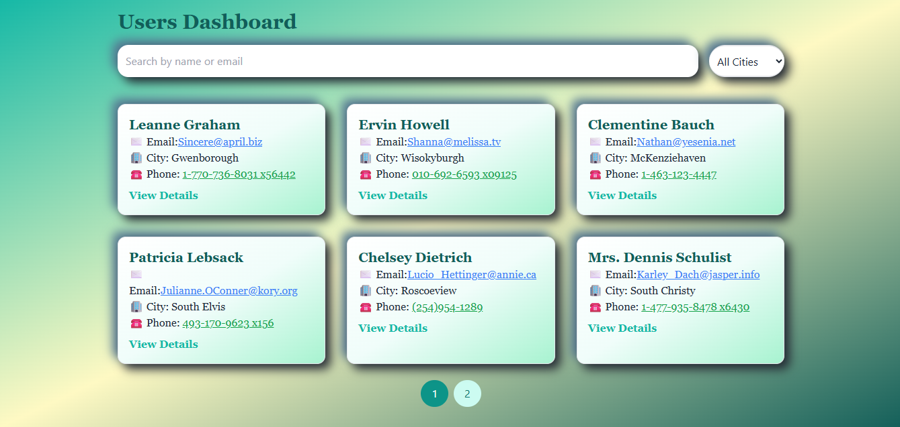
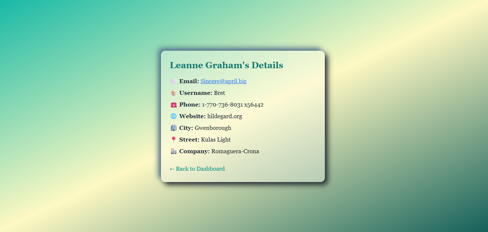
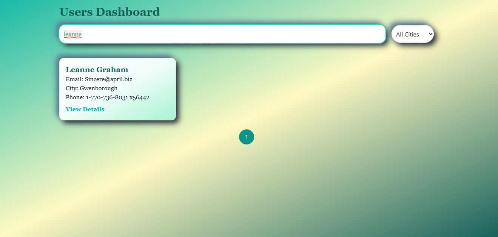
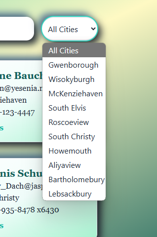

# Users Dashboard

A project that displays user information retrieved from an external API with a search interface, city filter, skeleton loader, and user details displayed upon clicking each user.

## ScreenShots:
### Dashboard

### Detalis

### Search

### Select

## ⚙️ How to Use

- **View Users:** The list of users will automatically load from the [jsonplaceholder API](https://jsonplaceholder.typicode.com).
- **Search:** Use the search bar to search users by name or email.
- **City Filter:** Filter users by city.
- **Pagination:** The page displays user data across multiple pages, with buttons to navigate between pages.
- **Details:** Click on any user to view their full details.

## 🛠️ Technologies Used

- **React:** For building the interactive user interface.
- **React Router:** For navigating between user pages.
- **Tailwind CSS:** For styling the interface with customizable CSS classes.
- **Fetch API:** To fetch user data from the API.
